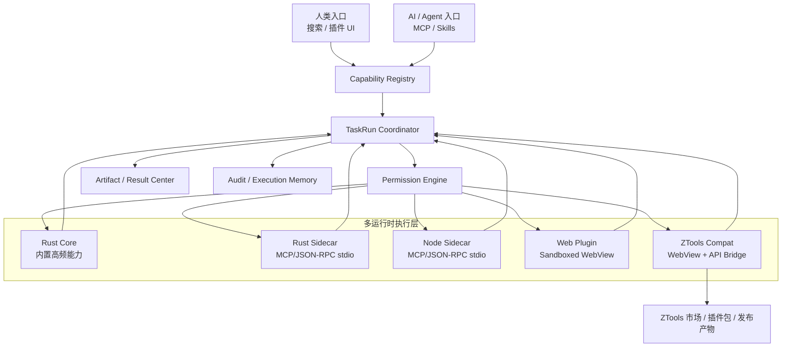
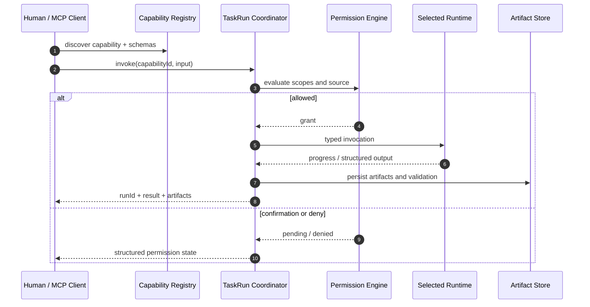

+# ADR-0001：Rust 核心与多运行时插件混合架构

- 状态：Accepted
- 日期：2026-07-22
- 决策人：项目所有者
- 关联北极星：`docs/superpowers/specs/2026-07-14-atools-product-engineering-north-star.md`

## 背景

ATools 已证明 Rust/Tauri 在包体、常驻内存和窗口唤起方面具有明显优势，但独立重建插件市场、账号体系和开发者生态的成本高于性能收益。同期 ZTools 3.0.1 已建立市场服务、发布 CLI、Provider 和百级插件仓库。

本机真实样本中，ATools 扫描 125 个 ZTools 插件，仅 59 个完全兼容、61 个可启动、21 个进入 ready 候选。继续增加 Rust 内置插件不能解决生态冷启动，优先级必须转向兼容运行时和统一能力协议。

## 决策

ATools 采用“Rust 核心 + ZTools 生态兼容”的混合架构，并支持 Rust、Node、Web 三类新增插件。

ATools 不建设独立封闭插件生态。市场客户端优先消费 ZTools 兼容的目录、安装包与元数据；本地负责缓存、签名/校验、权限、隔离、版本和审计。

## 系统架构



## 插件运行时契约

### Rust 插件

Rust 插件以可执行侧车交付，不允许把第三方动态库直接载入 ATools 主进程。

推荐协议：

1. MCP stdio：适合天然面向 Agent、已经声明 tools/resources/prompts 的插件。
2. JSON-RPC stdio：适合轻量、确定性的本地能力。
3. Web UI 可选：需要界面时，由单独 Web 入口调用同一侧车能力。

### Node 插件

Node 插件运行在受控子进程中：

- 使用固定 Node 版本或明确的 runtime requirement。
- 默认无 shell、文件、网络权限，按 manifest scope 授权。
- 标准输出仅承载协议，日志写标准错误或结构化日志通道。
- 必须支持超时、取消、进程回收和资源上限。

### Web 插件

Web 插件运行在隔离 WebView：

- 默认禁止任意 Node/Electron 访问。
- 通过类型化 Host Bridge 调用 Capability。
- CSP、导航、下载、剪贴板、文件和网络能力均受权限控制。
- UI 关闭不等于后台 TaskRun 被强制终止，生命周期由执行协调器管理。

### ZTools 兼容插件

缺少 `runtime` 字段的传统 `plugin.json` 默认解释为：

- `kind = web`
- `compatibility = ztools`
- `transport = host_bridge`

兼容层优先复现 ZTools API 语义，不要求插件作者改包。无法安全兼容的 API 必须报告明确状态，不得静默伪成功。

## Manifest 扩展

新 ATools 插件可以声明：

```json
{
  "name": "example-worker",
  "version": "1.0.0",
  "runtime": {
    "kind": "rust",
    "compatibility": "native",
    "transport": "mcp_stdio",
    "entry": "bin/example-worker"
  },
  "tools": {
    "run": {
      "description": "Run an example task",
      "inputSchema": {
        "type": "object",
        "properties": {
          "value": { "type": "string" }
        },
        "required": ["value"]
      },
      "outputSchema": {
        "type": "object",
        "properties": {
          "result": { "type": "string" }
        }
      }
    }
  },
  "permissions": ["file.read"]
}
```

允许值：

| 字段 | 值 |
| --- | --- |
| `runtime.kind` | `rust`、`node`、`web` |
| `runtime.compatibility` | `native`、`ztools` |
| `runtime.transport` | `host_bridge`、`json_rpc_stdio`、`mcp_stdio` |

## MCP 与 AI 友好约束

每个可调用能力必须进入统一 Capability Registry，并至少声明：

- 稳定 `id`、名称、描述和版本。
- JSON Schema 输入；能结构化时必须声明输出 schema。
- 权限 scopes 与风险性质。
- 是否允许人类调用、Agent 调用。
- 执行器、插件 runtime、兼容协议和当前可用性。
- 超时、取消与 TaskRun 状态。
- 结构化结果、Artifact 引用和可验证状态。



AI 不直接选择“Rust/Node/Web”实现。AI 选择 Capability；运行时路由由 Registry 和 Coordinator 决定。

## 市场策略

- 默认兼容 ZTools 插件目录与发布包。
- 不复制其账号、评论和服务端社区。
- ATools 可以维护本地可信源列表、离线索引和企业私有目录。
- 安装前执行 checksum、签名、路径穿越、包体、文件数和权限审计。
- 市场来源不自动获得权限；安装、启用、授权是独立状态。

## 迁移阶段

### Phase 1：模型与文档

- Manifest 增加 runtime/compatibility/transport。
- Capability 暴露运行时元数据。
- 旧 manifest 默认进入 ZTools Web 兼容路径。

### Phase 2：ZTools 生态优先

- 对 Top 30 插件建立自动兼容矩阵。
- 完全兼容率目标不低于 90%。
- 接入兼容市场目录和安装包，不建立第二套发布后台。

### Phase 3：Node/Rust Sidecar

- 实现统一进程监督器。
- 支持 JSON-RPC stdio 和 MCP stdio。
- 接入超时、取消、资源限制、权限与 TaskRun。

### Phase 4：统一开发工具

- 提供 manifest 校验、开发模式和打包命令。
- Rust/Node/Web 模板共享 tools/schema/permissions 规范。
- 生成 MCP 可发现描述与人类 UI 入口。

## 不采用的方案

### 完整 Rust 重写 ZTools

拒绝原因：无法复用生态，持续追赶 UI/API/市场，产品价值不足以覆盖迁移成本。

### 所有插件内嵌主进程

拒绝原因：崩溃、ABI、供应链和权限风险不可接受。

### 为每种运行时建立独立能力体系

拒绝原因：会造成 Human、MCP、AI 多套权限、审计和执行语义，违背北极星。

## 验收指标

- ZTools Top 30 插件完全兼容率 ≥ 90%。
- 任意运行时能力都可通过同一 Capability Catalog 发现。
- Agent 可获得输入/输出 schema、权限和可用性，不依赖阅读插件 UI。
- 所有执行产生 TaskRun；失败、取消和权限等待状态可观察。
- ATools 空闲 RSS、唤起和包体优势不得因兼容层退化到 ZTools 同量级。
