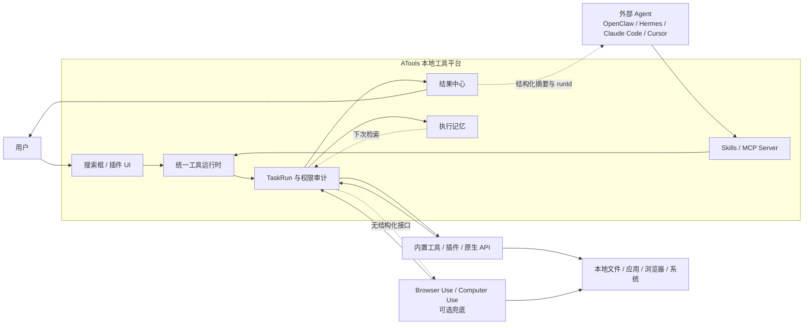
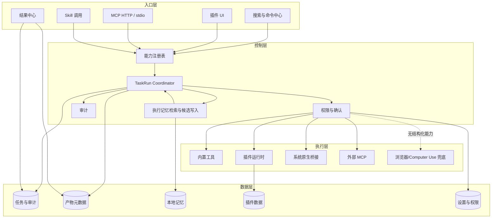
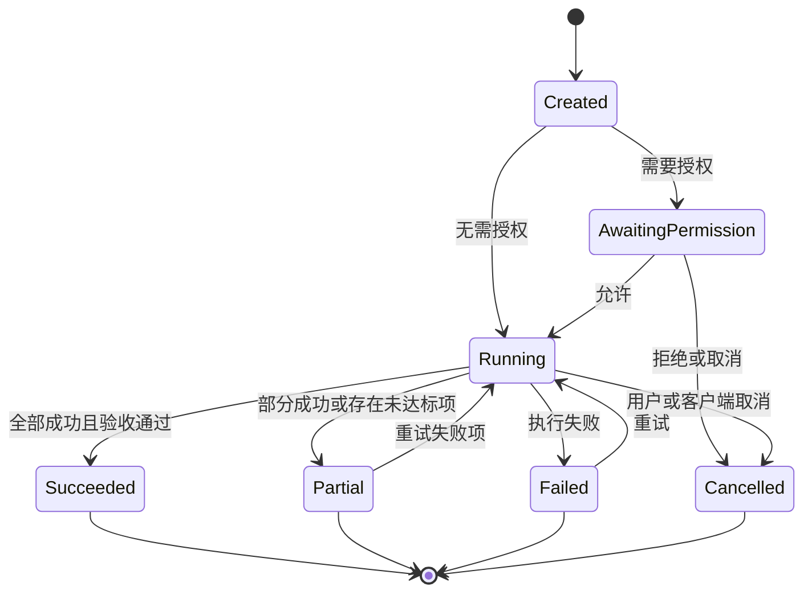
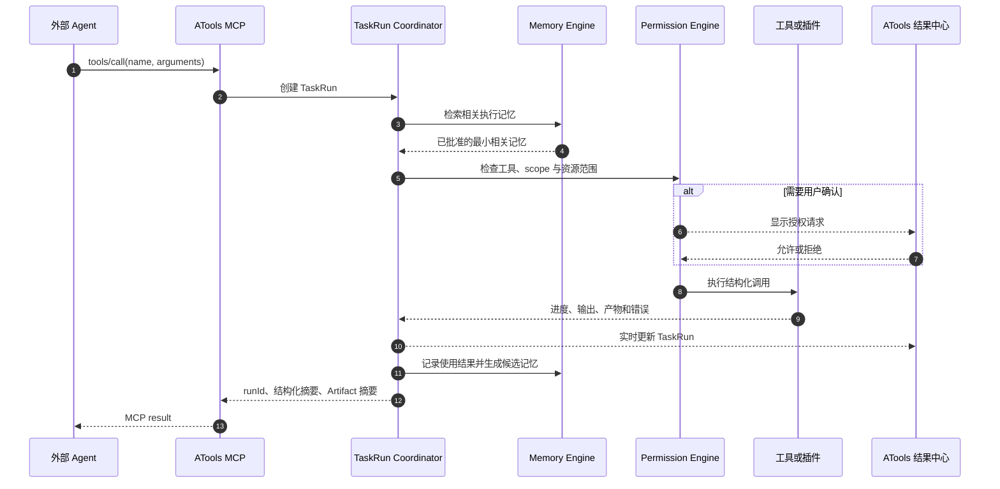

# ATools 产品与工程北极星

> 状态：Accepted  
> 日期：2026-07-14  
> 适用范围：ATools 桌面端、核心运行时、插件系统、Skills、MCP、任务结果与长期记忆  
> 决策性质：产品定位与工程边界。后续功能设计、架构调整和 Agent 实现计划必须与本文一致。

## 1. 文档目的

本文用于防止 ATools 在后续实现中偏离最初目标，尤其避免因追逐通用 Agent、Computer Use、Browser Use 或大模型热点而演变为另一个 OpenClaw、Hermes 或聊天客户端。

本文回答五个问题：

1. ATools 是什么。
2. ATools 不是什么。
3. 用户和外部 Agent 如何共用同一套本地工具能力。
4. 可视化结果与长期记忆如何成为一等能力。
5. 新需求进入工程计划前必须经过哪些检查。

若后续需求与本文冲突，应先修改并重新确认本文，而不是在实现中静默改变产品方向。

## 2. 核心决策

ATools 的产品定位是：

> **面向用户与 Agent 的高性能、轻量、本地优先的桌面工具运行时与结果工作台。**

面向用户的简化表达是：

> **一个工具箱，两种入口：人可用，Agent 可调，结果可见，重复操作越用越准。**

ATools 以 Rust、Tauri 和本地数据层实现低资源占用、低延迟和稳定执行；用户可通过搜索框和插件 UI 直接使用工具，外部 Agent 可通过 Skills 和 MCP 调用同一套能力；无论入口来自哪里，执行都进入统一的 `TaskRun`，产物都进入可视化结果中心，经过用户验证的参数、修正和成功经验可沉淀为本地执行记忆。

## 3. 为什么做这个产品

### 3.1 原始目标保持不变

ATools 起初的目标是用 Rust/Tauri 构建一个比 Electron 类工具箱更轻量、更高性能的 uTools 风格工具平台。这个目标仍然成立，不能被“必须成为通用 AI Agent”的叙事替换。

Rust 是实现手段，用户价值必须表现为可验证的结果：

- 更快的冷启动和热键唤起。
- 更低的空闲与多插件内存占用。
- 更低的搜索和插件激活延迟。
- 更稳定的插件隔离与失败恢复。
- 无模型、无账号、无网络时仍可直接使用。

### 3.2 大模型改变入口，不消灭工具运行时

Computer Use 和 Browser Use 已经可以直接操作电脑和浏览器。因此，ATools 不以“让 AI 能够点击电脑”作为卖点，也不假设外部 Agent 必须通过 ATools 才能操作系统。

ATools 提供的是另一条更适合确定性任务的路径：结构化工具调用、持久任务状态、专业结果展示和可复用执行记忆。Computer Use 是缺少结构化接口时的可选兜底执行器，不是默认执行方式，也不是 ATools 自研模型方向。

### 3.3 不强行寻找垂直场景

当前没有确定的垂直行业场景。工程不得为了制造商业叙事而提前绑定财务、电商、医疗或其他行业。ATools 先做好通用本地工具平台；未来垂直工作流应以真实用户需求和可衡量的重复任务为依据，并作为 Skills/工作流包构建在通用底座之上。

## 4. 产品边界

### 4.1 ATools 必须做的事

- 高性能桌面启动器、搜索入口和命令中心。
- 本地插件安装、运行、隔离、升级和结果展示。
- uTools/ZTools 风格插件的兼容扫描、迁移和运行支持。
- 内置工具、插件工具、Skills 和 MCP Tools 的统一能力目录。
- 外部 Agent 可调用的模型无关 MCP Server。
- 用户可直接操作的可视化面板。
- 持久化任务、结构化产物、错误、进度、重试与撤销入口。
- 与工具执行结果绑定的本地长期记忆。
- 权限、审计、敏感数据保护和清晰的执行来源。
- 无模型模式：核心工具功能不得依赖大模型才能使用。

### 4.2 ATools 明确不做的事

- 不自研通用基础模型或 Computer Use 模型。
- 不以通用聊天机器人作为产品核心。
- 不复制 OpenClaw 的多消息渠道个人助手定位。
- 不复制 Hermes 的通用自进化 Agent、远程沙箱和多 Agent 编排定位。
- 不把 MCP、Skills、长期记忆或权限确认本身宣传成独占护城河。
- 不以插件数量替代性能、兼容性和结果质量。
- 不要求每个工具都拥有独立定制 UI；优先使用统一结果协议和通用渲染器。
- 不让未经验证的模型推断直接写入永久记忆。
- 不让 Computer Use 成为可用结构化工具时的默认路径。

## 5. 与相邻产品的关系

| 产品/能力 | 主要角色 | ATools 的关系 |
| --- | --- | --- |
| uTools | 成熟商业工具平台与插件生态 | 对标用户体验与生态完整性，不复制商业体系 |
| ZTools | 开源 uTools 风格启动器和插件平台 | 主要兼容与迁移来源，也是性能对比对象 |
| OpenClaw | 常驻个人 AI 助手、Gateway、渠道与节点平台 | 可作为调用 ATools MCP 的上层 Agent |
| Hermes | 自我改进的通用 Agent、记忆与多环境执行平台 | 可作为调用 ATools MCP 的上层 Agent |
| Browser Use | 浏览器自动化执行器 | 可选外部执行后端，不在 ATools 内重复建设 |
| Computer Use | 通用视觉理解与桌面操作能力 | 无结构化接口时的最后一公里兜底 |
| Claude Code/Cursor/Codex | 开发与通用 Agent 客户端 | ATools MCP 的外部调用方 |

ATools 与 OpenClaw/Hermes 的推荐分工如下：



## 6. 核心设计原则

### 6.1 人机双入口，同一运行时

用户直接点击和 Agent 通过 MCP 调用不得形成两套实现。两种入口必须进入同一个能力注册表、权限层、任务执行层、审计层和结果层。

### 6.2 结构化优先，视觉操作兜底

执行器选择顺序为：

1. ATools 原生工具或类型化 MCP Tool。
2. 插件提供的确定性 API。
3. CLI、HTTP API 或系统原生 API。
4. DOM 或 Accessibility 自动化。
5. Browser Use / Computer Use 视觉操作。

若实现选择了较低优先级路径，必须记录原因。能调用工具时不得仅为了展示 Agent 能力而改用鼠标点击。

### 6.3 结果是一等对象

聊天文本、控制台日志或一个输出路径不能被视为完整结果。每次执行必须形成可持久化、可查看、可验证的 `TaskRunResult`，并尽可能提供结构化 `Artifact` 与后续 `ResultAction`。

### 6.4 记忆服务于准确执行

长期记忆优先保存用户确认的偏好、工作区事实、任务配方、纠正和失败恢复经验，不以保存完整聊天历史为目标。记忆必须有作用域、来源、置信度、使用记录和删除入口。

### 6.5 模型无关

ATools 的工具、结果和记忆不得绑定单一模型供应商。外部 Agent 只接收完成当前任务所需的最小上下文。更换模型后，用户的工具、历史结果和执行记忆仍然可用。

### 6.6 性能必须可测

“Rust 更轻、更快”必须通过可复现基准证明。任何可能显著影响启动、唤起、搜索、内存或插件激活的变更，都必须附带性能影响说明或基准结果。

## 7. 逻辑架构



## 8. 核心领域模型

### 8.1 Capability

`Capability` 是用户或 Agent 可发现的能力。来源可以是内置工具、插件、Skill 或外部 MCP。

最低字段：

- 稳定唯一标识。
- 名称、描述和来源。
- 输入与输出 schema。
- 权限 scope。
- 是否支持直接人工调用。
- 是否支持 Agent 调用。
- 执行器类型和可用性。
- 版本与兼容信息。

### 8.2 Skill

`Skill` 描述完成任务的方法，而不是替代原子工具。Skill 应声明：

- 使用场景与触发条件。
- 所依赖的能力。
- 建议执行顺序。
- 权限需求。
- 已知失败模式和恢复方式。
- 验收规则。
- 结果展示建议。

技能原则：MCP Tool 负责“能做什么”，Skill 负责“怎样把事情做好”。

### 8.3 TaskRun

所有人工和 Agent 执行都必须创建 `TaskRun`。最低字段：

```ts
interface TaskRun {
  id: string
  capabilityId: string
  initiator: {
    type: "human" | "agent" | "automation"
    clientId?: string
  }
  status: "created" | "awaiting_permission" | "running" | "partial" |
    "succeeded" | "failed" | "cancelled"
  input: unknown
  summary?: string
  progress?: number
  artifacts: Artifact[]
  warnings: TaskIssue[]
  errors: TaskIssue[]
  actions: ResultAction[]
  memoryIds: string[]
  startedAt?: string
  finishedAt?: string
}
```

任务状态必须遵循统一生命周期：



### 8.4 Artifact

`Artifact` 是可查看、可复用的执行产物，至少支持：

- 文件与目录。
- 图片和截图。
- Markdown 和富文本。
- 表格与 CSV。
- JSON。
- 前后 Diff。
- URL。
- 执行报告与日志。

Artifact 只保存必要元数据和受控引用；大文件不得无条件复制进数据库。

### 8.5 ResultAction

结果页面允许声明后续动作：

- 打开文件或目录。
- 复制。
- 导出。
- 重试失败项。
- 继续处理。
- 撤销。
- 保存为任务配方或 Skill。

每个动作必须再次经过能力与权限检查，不能因来自可信结果页而绕过策略。

### 8.6 MemoryItem

```ts
interface MemoryItem {
  id: string
  type: "preference" | "workspace_fact" | "task_recipe" |
    "correction" | "failure_recovery"
  scope: {
    workspace?: string
    skill?: string
    tool?: string
    application?: string
    domain?: string
  }
  content: unknown
  sourceRunId?: string
  confidence: number
  approval: "explicit" | "confirmed_candidate" | "temporary"
  useCount: number
  successCount: number
  lastUsedAt?: string
  expiresAt?: string
  createdAt: string
  updatedAt: string
}
```

## 9. MCP 与可视化结果契约

### 9.1 调用原则

ATools 的 MCP Tool 不仅返回文本，还应返回：

- 结构化结果摘要。
- `runId`。
- 状态。
- 关键指标。
- Artifact 摘要。
- 可选的结果页面 deep link 或本地资源标识。

外部 Agent 应能用简洁结果继续推理；用户应能在 ATools 打开完整结果，而无需从聊天消息中寻找输出路径。

### 9.2 推荐时序



### 9.3 长任务

长任务必须支持状态查询、取消和结果读取。不得为了保持一次 MCP 请求长时间打开而牺牲任务持久性。协议实现可按当前 MCP 能力选择同步短任务或异步 `runId`，但领域层统一使用 `TaskRun`。

## 10. 可视化结果中心

结果中心不是聊天窗口，也不是任意 HTML Canvas。它是持久任务与专业产物的统一工作台。

必须支持：

- 进行中、成功、部分成功、失败和取消状态。
- 发起来源、工具、Skill、Agent 客户端和执行时间。
- 进度、关键指标、警告和错误。
- 图片网格、文件列表、表格、Markdown、JSON 和 Diff 渲染。
- 失败项单独重试。
- 打开输出位置、复制、导出和后续处理。
- 显示本次使用了哪些记忆，以及记忆如何影响参数。
- 显示结果是否经过验收，而不是仅显示“工具调用成功”。

允许插件提供专用渲染器，但必须有安全边界和通用降级展示，不能要求所有结果都执行任意插件 HTML。

## 11. 长期执行记忆

### 11.1 记忆类型

1. 用户偏好：默认格式、是否保留原件、确认习惯。
2. 工作区事实：目录、命名规范、构建命令、允许域名。
3. 任务配方：被验证成功的多步骤参数和顺序。
4. 用户修正：排除规则、字段解释、目标路径等明确纠正。
5. 失败恢复：已知故障、替代执行器和重试策略。

### 11.2 写入策略

- 用户明确说“以后都这样”：可直接形成 `explicit` 记忆。
- 系统从多次执行推断：只能形成候选，用户确认后变为 `confirmed_candidate`。
- 当前会话或一次任务上下文：使用 `temporary`，按期限清理。
- 模型不得自行把推断事实升级成永久记忆。

### 11.3 检索策略

第一阶段使用结构化作用域匹配，顺序为：

1. 当前工作区。
2. 当前 Skill。
3. 当前工具。
4. 当前应用或域名。
5. 用户全局偏好。

只有在记忆规模和召回问题证明有必要后，才增加本地向量或语义检索。不得为了“AI 化”过早引入远程 embedding 依赖。

### 11.4 隐私边界

默认不得写入长期记忆：

- 密码、API Key 和会话 Token。
- 未脱敏的完整剪贴板历史。
- 原始屏幕录制与无期限截图。
- 与任务无关的文件全文。
- 身份证、银行卡等高敏感数据。
- 未经确认的用户身份或业务推断。

凭据进入独立 Secret Vault；记忆只保存凭据引用。用户必须能查看、编辑、停用、删除、导出和清空记忆。

## 12. 性能与工程质量

### 12.1 必须建立的基准

- 安装包体积。
- 冷启动到可交互时间。
- 热键按下到首帧时间。
- 1 万和 10 万条数据下的搜索 P50/P95/P99。
- 空闲 RSS 与 CPU。
- 打开轻型和重型插件后的内存增量。
- 插件冷启动时间。
- 多次唤起与长时间运行的内存稳定性。
- 任务结果和记忆增长后的数据库性能。

在首次竞品基准完成前，不设置脱离实测的绝对宣传数字。发布目标应根据 uTools、ZTools 和 ATools 同机同场景结果制定，并进入持续回归。

### 12.2 当前发布硬门槛

下列事项优先级高于继续扩展通用 Agent 功能：

- 正式签名、公证与 Gatekeeper 通过。
- 自动更新。
- 插件安装、更新和卸载的事务化与失败恢复。
- symlink、ZIP 配额、并发和可信市场校验。
- 真实快捷键、托盘与开机启动验证。
- 前端、Tauri 和 Cargo 版本统一。

## 13. 分阶段实施路线

### Phase 0：证明基础产品

- 完成发布安全与 macOS 真实验证。
- 建立与 uTools/ZTools 的性能基准。
- 保证搜索、插件启动和常驻资源优势可测。
- 继续提升 ZTools 插件迁移与兼容率。

### Phase 1：统一 TaskRun 与 Artifact

- 建立 TaskRun 数据模型与状态机。
- 将现有内置工具接入统一任务层。
- 建立通用结果渲染器。
- MCP 返回结构化结果与 `runId`。
- 支持任务历史、失败重试、取消和打开产物。

### Phase 2：Skills 与执行记忆

- Skill 声明工具依赖、权限、验收与结果建议。
- 建立 MemoryItem 与作用域检索。
- 从用户明确偏好和修正开始，不先做自动学习。
- 在结果页显示记忆来源和影响。
- 支持将成功任务保存为个人任务配方。

### Phase 3：能力生态

- 插件开发 CLI、模板和类型定义。
- 插件、无界面 Tool、Skill 和结果渲染器的统一分发模型。
- 签名市场、权限声明和自动兼容测试。
- 根据真实需求扩展 Windows 与工作流包。

## 14. 成功指标

### 14.1 基础产品

- 启动、唤起、搜索、内存和插件激活相对竞品的实测表现。
- 崩溃率和长时间运行稳定性。
- ZTools 插件兼容率、迁移成功率和回退率。
- 无模型使用占比与核心工具可用性。

### 14.2 人机双入口

- 用户直接调用与 Agent 调用是否进入同一 TaskRun。
- MCP 调用产生可视化结果的比例。
- 用户从 Agent 结果打开 ATools 结果页的比例。
- 任务因缺乏结构化结果而需要查看原始日志的比例。

### 14.3 执行记忆

- 重复任务成功率变化。
- 用户重复补充参数次数变化。
- 用户纠正与中途接管次数变化。
- 错误记忆触发率和记忆使用后的回滚率。
- 被验证任务配方的复用次数。

## 15. 防偏离检查清单

任何新功能、重构计划或 Agent 自动生成的实施方案，在进入开发前必须回答：

1. 它是否改善启动、搜索、插件、结果或重复任务准确率中的至少一项？
2. 它是否同时服务用户入口与 Agent 入口，或有充分理由只服务其中一方？
3. 它是否复用统一 Capability、TaskRun、Artifact、Permission 和 Memory 模型？
4. 它是否把 ATools 推向通用聊天 Agent、消息渠道平台或模型训练平台？如果是，默认拒绝。
5. 是否已有结构化工具可完成任务？如果有，不得默认使用 Computer Use。
6. 是否产生可视化、可验证、可持久化结果？
7. 是否明确区分“工具调用成功”和“用户目标验收成功”？
8. 是否会把未经确认的推断写入长期记忆？如果会，必须拒绝。
9. 是否引入模型、云服务或远程 embedding 的强制依赖？核心工具不得因此失去离线能力。
10. 是否影响启动、内存、安装包或搜索性能？必须提供测量方式。
11. 是否重复实现 OpenClaw、Hermes、Browser Use 或模型厂商已有的通用 Agent 能力？如果是，应优先集成而非重建。
12. 它是否让 uTools/ZTools 风格插件迁移更困难？若会破坏兼容，必须提供迁移策略。

若以上问题无法清楚回答，需求不得直接进入实现。

## 16. 当前代码映射

现有工程已经具备部分基础：

| 目标能力 | 当前基础 |
| --- | --- |
| 本地工具与权限 | `src-tauri/src/agent_tools.rs`、`crates/atools-core/src/agent.rs` |
| MCP HTTP/stdio | `src-tauri/src/mcp_server.rs`、`docs/agent-mcp-client.md` |
| 插件运行时 | `crates/atools-plugin`、`src/components/PluginPanel.svelte` |
| 搜索匹配 | `crates/atools-core/src/matcher.rs`、`src/lib/searchMatch.ts` |
| ZTools 迁移 | `src-tauri/src/ztools_import.rs`、`src/components/ZToolsImportPanel.svelte` |
| 插件权限 | `src/lib/pluginRuntimePermissions.ts`、`src/components/PermissionConfirmDialog.svelte` |
| WebDAV | `src-tauri/src/webdav.rs` |
| 当前任务/UI基础 | `src/components/AgentPanel.svelte`、`src/components/HomePanel.svelte` |

尚未完成、不得在宣传或设计评审中视为现成功能：

- 统一 TaskRun 领域层。
- 通用 Artifact 与 ResultAction 协议。
- 持久化专业结果中心。
- 本文定义的执行记忆系统。
- 结果驱动的成功率评估。
- 已被实测证明的跨竞品性能优势。

## 17. 评审与更新规则

本文在以下情况必须重新评审：

- 产品准备转向通用 Agent 或垂直行业产品。
- 统一任务/结果数据模型发生不兼容变化。
- 长期记忆开始自动写入或使用远程存储。
- Computer Use 从兜底执行器变为主要执行器。
- 插件兼容策略发生重大变化。
- 性能基准证明当前技术路线无法达成轻量目标。

更新本文时必须同时更新 codebase-memory ADR，使后续 Agent 的架构检索能够获得同一决策。

## 18. 结论

ATools 不与 OpenClaw、Hermes 或通用大模型争夺“谁是用户的主 Agent”。ATools 做好更底层、也更贴近桌面的事情：以低资源和低延迟运行本地工具，让用户直接使用，让任何 Agent 通过标准协议调用，并把执行过程、产物、错误和长期经验沉淀在一个可视化、可验证、可复用的本地工作台中。

后续工程工作的优先顺序是：

1. 发布安全与性能证明。
2. TaskRun 和结构化结果中心。
3. Skills、MCP结果契约与执行记忆。
4. 插件与能力生态。

不得用扩展通用 Agent 功能替代以上主线。

