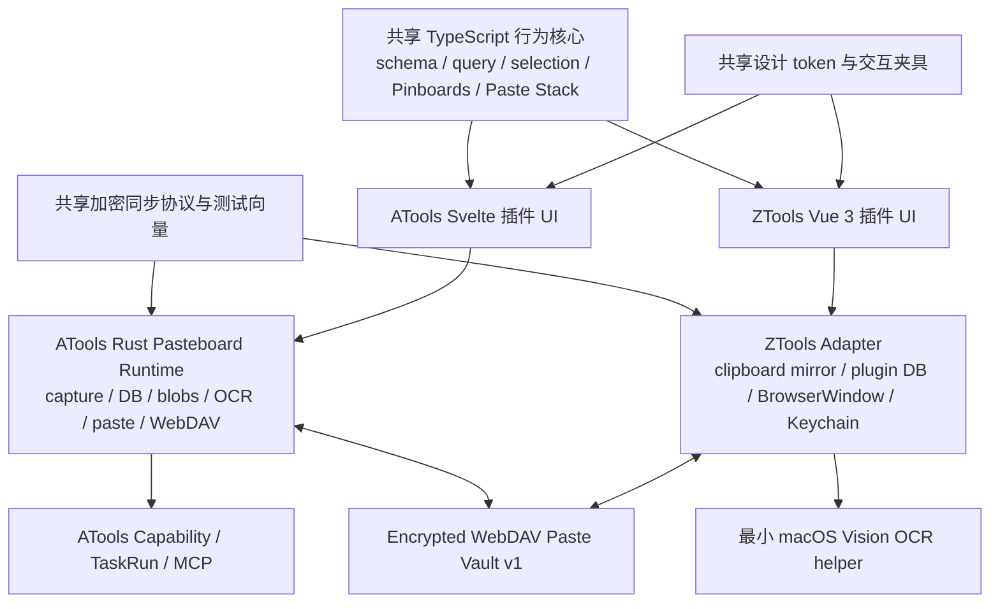

# PasteboardPro ATools 与 ZTools 插件化设计

> 状态：Accepted
>
> 日期：2026-07-15
>
> 适用范围：ATools、ZTools 插件、PasteboardPro 共享行为核心、macOS 原生适配、加密 WebDAV 同步
>
> 产品边界依据：`docs/superpowers/specs/2026-07-14-atools-product-engineering-north-star.md`

## 1. 目标

将现有 PasteboardPro 的产品能力重新实现为两个独立插件：

- ATools 插件：Svelte 前端，复用 ATools 的 Rust/Tauri 能力、权限、TaskRun、MCP 与 WebDAV 设置。
- ZTools 插件：Vue 3 前端，复用 ZTools 的剪贴板、插件数据库、BrowserWindow 与 Node/Electron 能力。

两个插件需要达到当前 macOS 版 Paste.app 的核心 UI 与交互水平，包括：

- 底部浮动的 Liquid Glass 剪贴板时间线。
- 历史捕获、搜索、过滤、OCR、Pinboards、预览与编辑。
- Quick Paste、多选粘贴、纯文本粘贴与 Paste Stack。
- 隐私排除、暂停捕获、历史保留与屏幕共享保护。
- 使用同一加密 WebDAV 协议，在 ATools 与 ZTools 之间同步数据。

本设计不复制 Paste 的名称、图标、商标或专有视觉素材。插件继续使用 PasteboardPro 作为产品与包标识，复刻目标仅限产品能力、信息层级、布局、状态、动效与操作体验。

## 2. 研究依据

设计基于 2026-07-15 对 Paste 官方公开资料的实时检索：

- [Paste on Mac](https://pasteapp.io/help/paste-on-mac)
- [Search and filters](https://pasteapp.io/help/search-and-filters)
- [Organize with Pinboards](https://pasteapp.io/help/organize-with-pinboards)
- [Using Paste Stack](https://pasteapp.io/help/using-paste-stack)
- [What Paste captures](https://pasteapp.io/help/what-paste-captures)
- [Paste 6 in Liquid Glass](https://pasteapp.io/blog/paste-in-liquid-glass)

现有 PasteboardPro Swift 源码只作为能力和边界参考，不作为两个插件依赖的常驻辅助进程。

## 3. 已确认范围

### 3.1 第一版必须实现

- macOS 上完整的核心 UI 与交互。
- 文本、富文本、HTML、链接、图片、PDF、颜色和文件历史。
- 来源应用、设备、复制时间、内容类型和自定义标题元数据。
- 去重、历史保留、固定与 Pinboards 长期保留。
- 即时全文搜索、组合过滤、OCR 搜索和 Jump to History。
- Pinboard 创建、改名、改色、删除、排序、拖放和项目移动。
- Space 预览、文本编辑、重命名、新建文本、图片旋转和 OCR 文本提取。
- 键盘导航、多选、拖拽、Quick Paste、纯文本粘贴和 Paste Stack。
- 敏感应用与内容排除、暂停捕获和屏幕共享保护。
- ATools 与 ZTools 双向加密 WebDAV 同步。
- ATools 插件的人类 UI 与 MCP/TaskRun 共用同一个能力运行时。

### 3.2 第一版不做

- Paste 品牌、图标或专有素材复制。
- Paste 的 iCloud 同步实现。
- 多用户 Shared Pinboards、邀请链接和协作权限。
- Apple Intelligence Writing Tools 的跨宿主复刻。
- Windows/Linux 完整交互与原生能力验收。
- 现有 PasteboardPro 历史、Pinboards 或附件迁移。
- 依赖 PasteboardPro 原生 App 常驻运行。

### 3.3 平台边界

- macOS 是第一版唯一的高还原验收平台。
- Windows/Linux 可安装并提供基础浏览能力，但不进入第一版完成门槛。
- 直接粘贴、Quick Look、Vision OCR、透明浮窗、屏幕共享保护等能力在 macOS 上使用原生实现。

## 4. 仓库与代码边界

### 4.1 插件共享工作区

共享插件源码位于：

`/Users/harris/Desktop/ZTools-plugins/plugins/pasteboard-pro/`

建议结构：

```text
plugins/pasteboard-pro/
├── package.json
├── packages/
│   ├── core/                 # 无框架 TypeScript 行为核心
│   ├── design-tokens/        # 颜色、圆角、间距、动效和窗口几何
│   ├── contract-fixtures/    # 跨前端交互、同步和加密夹具
│   └── sync-protocol/        # WebDAV 数据格式、合并规则和测试向量
├── apps/
│   ├── atools/               # Svelte 插件 UI
│   └── ztools/               # Vue 3 插件 UI
├── adapters/
│   ├── atools/               # ATools bridge 客户端
│   └── ztools/               # ZTools clipboard/DB/BrowserWindow 客户端
└── native/
    └── ztools-macos-vision/  # 最小签名 OCR 辅助程序
```

该工作区构建两个独立插件包。两个包共享行为代码、协议和测试夹具，但不共享 UI 组件实现。

### 4.2 ATools 仓库

`/Users/harris/Desktop/atools` 负责：

- Rust 剪贴板捕获与本地持久化。
- 内容寻址附件存储和容量治理。
- macOS Vision OCR、Quick Look 和 Accessibility 直接粘贴。
- 可停靠的透明底部插件浮窗。
- Keychain 密钥保存与加密 WebDAV 同步。
- 面向插件 UI 的受限 bridge。
- 面向 Agent 的 MCP tools、权限、审计和 TaskRun。

### 4.3 PasteboardPro 源码目录

`/Users/harris/Desktop/PasteboardPro` 保留为行为参考，不承载新插件构建。

已按用户确认完成清理：

- 删除 `dist/PasteboardPro.app`。
- 删除 PasteboardPro 运行数据、CrashReporter 记录和偏好配置。
- 保留 Swift 源码、测试、文档与脚本。
- 不导入历史数据。

## 5. 总体架构



架构原则：

1. ATools 与 ZTools 可独立运行，不能互相作为运行前置条件。
2. 两套 UI 分开实现，但数据、搜索、选择、快捷键与同步语义只有一个定义。
3. 捕获、OCR、直接粘贴、密钥、附件与窗口定位留在宿主适配层。
4. ATools 的人类操作与 Agent 调用进入同一个能力服务，不形成两套业务实现。
5. ZTools OCR helper 只接受受控本地图片路径并返回文本，不提供任意命令或网络能力。

## 6. UI 与交互设计

### 6.1 视觉基准

- 当前 Paste 6 macOS Liquid Glass 是视觉来源。
- 浮窗使用透明深度、细边框、柔和阴影、系统强调色与内容主导的卡片。
- Expanded Mode 使用大预览；缩短高度时连续过渡到 Compact Mode。
- ATools/WebKit 与 ZTools/Electron 可有字体和模糊渲染差异，但几何、层级、token 与状态必须一致。

### 6.2 窗口与停靠

- 默认通过 `Shift-Command-V` 打开或隐藏。
- 窗口为可调整高度的底部横向浮层，并记忆每个显示器的尺寸、位置、模式和停靠边。
- 悬浮时四角使用圆角。
- 进入显示器边缘 12 px 吸附区后贴边：
  - 贴底时取消底部两个圆角。
  - 贴左时取消左侧两个圆角。
  - 贴右时取消右侧两个圆角。
- 离开边缘后恢复全部圆角。
- 圆角、阴影和位置在 160 ms 内连续过渡；Reduced Motion 模式直接切换。
- 窗口定位必须避让 Dock、菜单栏、刘海和可见工作区。

### 6.3 时间线与卡片

- 历史按最近复制优先展示为横向时间线。
- 卡片展示内容预览、来源应用、复制时间、内容类型和自定义标题。
- 选中卡片具有明确的层级、阴影和焦点状态。
- 卡片列表必须虚拟化，不能随历史数量线性创建 DOM。
- 选择在搜索、调整高度、切换 Compact Mode 和 Pinboard 导航后尽量按 item ID 恢复。

### 6.4 搜索

- 打开窗口后直接输入即可搜索，`Command-F` 聚焦搜索。
- 搜索覆盖正文、标题、来源应用、设备、日期、内容类型、域名、扩展名、Pinboard 和 OCR 文本。
- 支持组合过滤、内联 filter chip、自动建议和结果高亮。
- 单项搜索结果支持 `Command-G` 跳回原始历史或 Pinboard 位置。

### 6.5 Pinboards

- Pinboard 有名称、颜色和稳定排序。
- 支持创建、改名、改色、删除、拖动排序与项目拖放。
- 单个项目同一时间属于一个 Pinboard。
- Pinboard 项目不受普通历史过期策略影响。

### 6.6 预览与编辑

- `Space` 打开与选中卡片对齐的预览层。
- 文本、链接、图片、PDF、颜色和文件使用专用预览器。
- `Command-E` 编辑，`Command-R` 重命名，`Command-N` 新建文本。
- 图片支持旋转和 OCR 文本查看/复制。
- 链接预览不能继承 WebDAV 凭据或同步网络权限。

### 6.7 键盘与粘贴

| 操作 | 默认快捷键 |
| --- | --- |
| 显示/隐藏 | `Shift-Command-V` |
| Paste Stack 捕获 | `Shift-Command-C` |
| 关闭 | `Escape` |
| 前后选择 | `Left` / `Right` |
| 首项/末项 | `Command-Up` / `Command-Down` |
| 扩展选择 | `Shift-Left` / `Shift-Right` |
| 全选 | `Command-A` |
| 粘贴 | `Return` |
| 纯文本粘贴 | `Shift-Return` |
| Quick Paste | `Command-1` 至 `Command-9` |
| Quick Paste 纯文本 | `Shift-Command-1` 至 `Shift-Command-9` |
| 复制回系统剪贴板 | `Command-C` |
| 搜索 | `Command-F` |
| Jump to History | `Command-G` |
| 预览 | `Space` |
| 编辑 | `Command-E` |
| 重命名 | `Command-R` |
| 新建文本 | `Command-N` |
| 新建 Pinboard | `Shift-Command-N` |
| 暂停捕获 | `Command-T` |

多选支持 Command/Shift 点击、拖拽和组合粘贴。Paste Stack 支持顺序切换、`Command-V` 逐项消费、滑动或菜单删除。

## 7. 数据模型

### 7.1 PasteItem

```ts
interface PasteItem {
  id: string
  kind: "text" | "rich_text" | "html" | "url" | "image" |
    "pdf" | "color" | "files"
  title?: string
  sourceApp?: { bundleId?: string; name?: string }
  sourceDeviceId: string
  copiedAt: string
  updatedAt: string
  contentFingerprint: string
  payload: PastePayloadReference
  ocrText?: string
  pinboardId?: string
  pinboardOrderKey?: string
  pinned: boolean
  fieldClocks: Record<string, HybridLogicalClock>
}
```

正文或附件内容不可原地覆盖。编辑创建新的 payload revision，标题、Pinboard、排序和标志使用字段级时钟合并。

### 7.2 Pinboard

```ts
interface Pinboard {
  id: string
  name: string
  color: string
  orderKey: string
  createdAt: string
  updatedAt: string
  fieldClocks: Record<string, HybridLogicalClock>
}
```

### 7.3 Tombstone

删除产生墓碑，保存实体 ID、删除时钟和来源设备。墓碑保留 180 天，优先于更旧的修改；显式恢复必须创建新 revision，不能静默复活。

## 8. 本地存储与容量

- ATools 使用 SQLite 元数据与内容寻址 blob 目录。
- ZTools 使用插件数据库与插件私有 blob 目录。
- 普通历史默认保留 90 天，可由用户调整。
- 本地附件默认预算 1 GB，可由用户调整。
- 超出预算时优先清理最旧、未固定且不属于 Pinboard 的附件字节。
- Pinboard 内容不得被容量治理静默删除；空间不足时显示明确状态与处理入口。
- 图片与 PDF 保留原始负载和可显示预览。
- 任意文件/文件夹默认保存本机路径与元数据；跨设备文件内容同步需要用户单独启用。

## 9. 加密 WebDAV 同步

### 9.1 基本原则

- 本地数据库是主数据源，WebDAV 是加密复制层。
- ATools 与 ZTools 使用相同同步密码和协议。
- WebDAV 密码与剪贴板同步密码分离。
- ATools 将解密密钥保存在 macOS Keychain。
- ZTools 通过受限的 macOS Keychain 适配保存本地密钥材料，不依赖 renderer 内可读的明文配置。
- ATools 现有 WebDAV 设置中的密码需要迁移到 Keychain；设置与备份数据只保留凭据引用。
- ZTools 的 WebDAV 密码和同步密钥分别保存为独立 Keychain item。
- 同步密码丢失不可恢复，不得自动清空或覆盖远端。

### 9.2 加密

- 使用 scrypt 从同步密码与随机 salt 派生 256-bit 主密钥。
- 每条记录和每个附件使用 AES-256-GCM 独立加密。
- 每个密文使用随机 96-bit nonce。
- schema 版本、对象 ID、对象类型和 revision 进入 authenticated additional data。
- blob 文件名使用主密钥派生的 keyed fingerprint，避免暴露明文内容 hash，同时保留去重能力。

### 9.3 远端布局

```text
PasteboardPro/v1/
├── vault.json       # 协议版本、KDF salt 和参数，不含剪贴板内容
├── index.enc        # 加密索引、设备游标和对象 revision
├── records/*.enc    # 加密 item、Pinboard 和 tombstone
└── blobs/*.bin      # 加密图片、PDF 和可选文件负载
```

WebDAV 仍能看到对象数量、近似大小、同步时间和账户身份，但不能读取标题、正文、OCR、Pinboards 或附件。

### 9.4 冲突处理

1. 拉取并验证 `index.enc` 和 ETag。
2. 下载缺失或更新的记录与附件。
3. 使用字段级 Hybrid Logical Clock 合并本地和远端状态。
4. 上传新的不可变 revision 与 blob。
5. 使用 `If-Match` 条件更新 `index.enc`。
6. ETag 冲突时重新拉取、合并和重试，不得盲目覆盖。

OCR、记录、附件和索引提交可以独立失败与重试；成功项不会因单个失败项回滚。

### 9.5 内容同步策略

- 文本、富文本、HTML、链接、颜色、元数据和 OCR 文本默认同步。
- 图片和 PDF 原始内容默认加密同步。
- 任意文件/文件夹默认只同步元数据。
- 用户可启用文件内容同步，单项上限 100 MB。
- 远端文件只存在元数据时，另一设备必须显示“文件不可用”，不能伪装为可粘贴。

## 10. 捕获与隐私

隐私规则在持久化前执行：

- 排除应用列表。
- pasteboard confidential/transient 标志。
- 已知密码管理器。
- 高置信度 token、私钥、验证码和支付卡规则。
- 用户字面量、通配符和正则规则。

`Command-T` 支持定时暂停或手动恢复。暂停状态必须在浮窗和菜单中可见。

可选屏幕共享保护使用原生 content protection，使浮窗和预览不出现在截图、录屏或共享画面中。

诊断与审计不得记录剪贴板正文、标题、OCR 文本、凭据、密钥或未脱敏路径。

## 11. 权限

| 权限 | 用途 | 降级行为 |
| --- | --- | --- |
| Clipboard Read | 捕获剪贴板 | 无法捕获新历史 |
| Clipboard Write | 复制和粘贴 | UI 只读 |
| Accessibility | 直接插入目标应用 | 降级为复制到系统剪贴板 |
| File Read | 读取剪贴板文件与附件 | 保留元数据，预览/粘贴不可用 |
| Network | 配置的 WebDAV origin | 仅本地使用，排队重试 |
| Keychain | 保存 WebDAV 凭据与本地同步密钥 | 每次启动重新输入或禁用同步 |
| OCR Helper | ZTools 图片 OCR | 图片仍可保存和粘贴，OCR 可重试 |

网络能力只能访问用户配置的 WebDAV origin。ZTools OCR helper 不允许联网。

## 12. 错误处理与恢复

- Accessibility 缺失：保留捕获、搜索和复制，显示打开系统设置入口。
- OCR 失败：保存原项目并标记 OCR 失败，允许单项重试。
- 磁盘不足：保留元数据和 Pinboards，清理可回收附件并显示容量处理入口。
- WebDAV 离线或鉴权失败：本地功能继续，显示同步状态并排队重试。
- 同步密码错误：验证失败后停止，不上传任何对象。
- 远端 schema 更新：本地继续可用，要求升级兼容版本，不降级远端。
- 远端完整性损坏：隔离损坏对象，保留最后验证游标，不合并未认证数据。
- 数据库迁移：先创建 checkpoint/备份，迁移并验证后原子切换，失败时保留旧库。
- 创建新远端 vault、遗忘旧 vault 或清除全部历史必须经过明确危险确认。

## 13. Agent 与 TaskRun

ATools 提供的插件能力至少包括：

- 搜索剪贴板历史。
- 读取单个项目的结构化元数据。
- 创建、列出和更新 Pinboards。
- 将项目加入或移出 Pinboard。
- 复制或粘贴选定项目。
- 查询同步状态和触发同步。

人工 UI 和 MCP tool 调用必须进入同一个 Pasteboard Runtime。需要副作用的调用经过权限检查并创建 TaskRun；返回结构化结果、状态、runId 和必要的 Artifact 摘要。

后台捕获事件不为每次复制创建可见 TaskRun，但必须遵循同一隐私与存储策略，并保留不含正文的诊断计数。

## 14. 测试与验收

### 14.1 共享核心

- schema 与 migration 测试。
- 查询解析、过滤建议、排序与 OCR 匹配测试。
- 选择、多选、Pinboard 排序和 Paste Stack 状态机测试。
- Hybrid Logical Clock 与 tombstone 合并测试。
- scrypt、AES-GCM 和跨语言测试向量。

### 14.2 跨前端一致性

Svelte 与 Vue 对同一夹具必须产生：

- 相同选中 item IDs。
- 相同搜索结果顺序。
- 相同 Pinboard order keys。
- 相同 Paste Stack 队列转换。
- 相同窗口几何 token 和停靠状态。
- 可互相读取的加密同步对象。

两个宿主分别维护截图 golden，因为 WebKit 与 Electron 的字体和 blur 渲染不同；布局、状态和 token 必须一致。

视觉矩阵至少覆盖：

- Expanded / Compact。
- 悬浮 / 底部停靠 / 左停靠 / 右停靠。
- Light / Dark。
- Normal Motion / Reduced Motion。
- 搜索过滤、Pinboards、预览编辑和 Paste Stack。

### 14.3 真实 macOS smoke

- 捕获文本、富文本、HTML、链接、图片、PDF、颜色和文件。
- 在 TextEdit、浏览器、Finder、Preview 和代码编辑器中验证原格式、纯文本、多选、拖拽、Quick Paste 和 Paste Stack。
- 验证 OCR、隐私排除、暂停捕获和权限撤销/恢复。
- 验证休眠唤醒、登录重启、显示器连接/断开和长期复制突发。
- 使用临时 WebDAV 同时运行 ATools/ZTools，注入断网、ETag 冲突、错误密码、密文损坏和附件上传中断。

### 14.4 工程性能门槛

初始内部目标：

- 参考 Apple Silicon Mac 上热唤起到首帧 P95 不超过 120 ms。
- 1 万项普通搜索 P95 不超过 50 ms。
- 10 万项普通搜索 P95 不超过 150 ms。
- 横向滚动和选中转场以 60 fps 为目标。
- 空闲捕获 CPU 接近零，复制突发不阻塞前台应用。

这些是工程门槛，不是宣传数字。完成同机 Paste/ZTools/ATools 基准后可重新校准，并必须保留可复现证据。

## 15. 发布门槛

只有同时满足以下条件才可宣称完成：

1. 共享行为、迁移、合并与加密兼容测试全部通过。
2. ATools 与 ZTools 两个真实 macOS 宿主 smoke 均通过。
3. 没有未关闭的高严重级数据丢失、隐私或越权问题。
4. ZTools OCR helper 和插件包经过签名/完整性验证。
5. ATools 的性能、权限和 TaskRun/MCP 证据完整。
6. 双端 WebDAV 并发与故障恢复有真实测试证据。

成功构建、单端测试通过或仅有 Web 预览截图均不足以完成验收。

## 16. ATools 北极星一致性

- 改善插件能力、搜索、结果和重复任务效率。
- 人类 UI 与 Agent 调用复用同一运行时。
- 结构化剪贴板 API 优先于 Computer Use。
- 同步、粘贴和 Agent 变更进入权限、审计和 TaskRun 边界。
- 无模型、无账号、无网络时核心本地能力仍可用。
- 不把未经确认的剪贴板内容写入长期记忆。
- 不将 ATools 转向通用聊天 Agent。
- 对启动、热键、搜索、内存和插件激活设置可复现测量。
- 提升而不是破坏 ZTools 插件兼容与迁移能力。

## 17. 设计结论

PasteboardPro 插件化采用“共享无框架行为核心 + 两套独立 UI + 两个原生宿主适配”的结构：ATools 使用 Svelte/Rust，ZTools 使用 Vue/Node/Electron。两个插件通过同一加密 WebDAV 协议互通，并以 Paste 6 的 macOS UI、交互和核心功能作为验收基准。

此设计接受双前端带来的实现成本，以换取各宿主技术栈独立性；通过共享状态机、设计 token、测试夹具、截图矩阵和同步兼容测试控制长期漂移。
